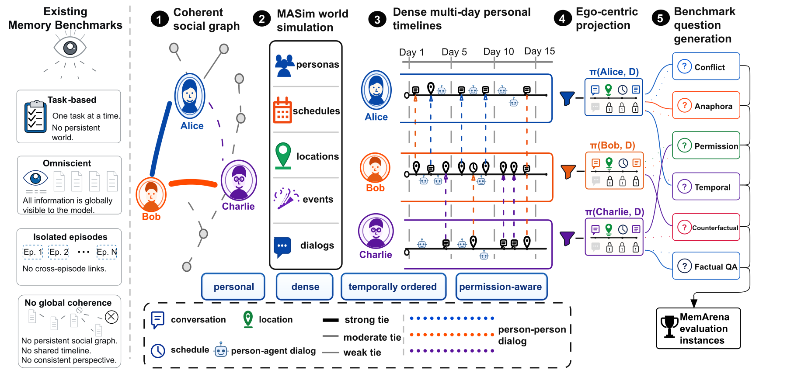

<h1 align="center">MemArena: An Ego-Centric Benchmark for On-Device<br>Agentic Personal Memory Assistants at Scale</h1>

<p align="center">
  <a href="https://arxiv.org/abs/2608.02613"></a>
  <a href="https://huggingface.co/datasets/dereksodo/memarena-l"></a>
  
  <a href="LICENSE"></a>
  <a href="docs/LICENSE"></a>
</p>

<p align="center"><b>Jiadong Zhang</b> and <b>Xiaosong Ma</b><br>MBZUAI</p>

<p align="center"></p>

**MemArena** evaluates personal-memory assistants the way they run on a device: every question is
asked from one person's own point of view, over the long, dense, multi-party history that this
person has observed. Its simulator, **MASim**, generates one coherent social world (personas, a
Dunbar-layered social graph, schedules, locations, events and dialogues) together with evaluation
instances whose gold answers point to the sessions that contain the evidence.

**MemArena-L** has 50 agents over 15 simulated days (13,343 sessions, ~10.3M dialogue tokens) and
1,523 evaluation instances across six dimensions of recall, reasoning and trustworthiness. It is a
controlled synthetic probe corpus, not a sample of human conversation.

## Key findings

Five open-weight readers (Qwen3-0.6B, Llama-3.2-3B, Mistral-7B, Qwen3-8B, Qwen3-32B-AWQ) are paired
with five memory conditions (Vanilla context, BM25-RAG, Memobase, MemSearch, and an evidence-only
Oracle).

1. **The memory backend matters more than reader scale for content accuracy.** At Qwen3-8B,
   switching from Memobase to MemSearch gains +22.1 / +21.2 pp in recall / reasoning; scaling the
   reader to Qwen3-32B-AWQ gains at most +3.5 / +4.4 pp under either backend.
2. **Permission-aware access fails universally.** Given the evidence, Oracle readers disclose the
   protected fact to requesters who should not receive it in 75–99% of cases; the deployable
   backends mostly fail to surface the fact at all.
3. **Memory search adds little latency.** On a Spark GB10 edge node, search costs a fixed
   87 / 8 / 51 ms (BM25-RAG / Memobase / MemSearch), which matters only for the smallest reader.

## Dataset

The dataset is on the [Hugging Face Hub](https://huggingface.co/datasets/dereksodo/memarena-l)
with a [dataset card](docs/DATASET_CARD.md) and [Croissant metadata](docs/memarena-croissant.json).

```bash
python scripts/download_dataset.py --out data/     # -> data/benchmark/
```

| Dimension | Task file(s) in `eval_instances/` | Items | Metric |
|---|---|--:|---|
| D1 Cloze fidelity | `d5_cloze` | 198 | accuracy |
| D2 Metadata completeness | `d6_metadata` | 169 | accuracy |
| D3 Factual QA | `d7_qa`, `d8_temporal`, `d10_counterfactual` | 502 | accuracy |
| D4 Cross-session reasoning | `d1_conflict`, `d2_anaphora` | 340 | accuracy |
| D5 Calibrated abstention | `d3_confabulation` | 170 | accuracy |
| D6 Permission-aware access | `d4_permission` | 144 | F1<sub>PU</sub> |
| **Total** | | **1,523** | |

F1<sub>PU</sub> is the harmonic mean of privacy (withholding the protected fact on DENY items) and
utility (disclosing it on ALLOW items); always refusing and always disclosing both score 0.

## Installation

```bash
git clone https://github.com/dereksodo/MemArena-Bench.git
cd MemArena-Bench
scripts/setup_venv.sh && source scripts/activate_venv.sh
python scripts/verify_install.py
```

Judging uses `openai/gpt-4o-mini-2024-07-18` through OpenRouter; put `OPENROUTER_API_KEY` in
`.env` (see [`.env.example`](.env.example)).

## Quick start

A smoke test that needs no GPU, services or API keys:

```bash
python run_masim.py --smoke --output out/smoke/masim --overwrite
python scripts/run_accuracy.py --dry-run --backend vanilla --n 10 --out-dir out/smoke/accuracy
python -m pytest tests -q
```

## Reproducing the paper

Each cell of the grid (reader × memory backend × seed) runs on one GPU with Docker and SGLang:

```bash
scripts/test_cell.sh -model 8b -backend oracle -gpu 0 -seed s2 -limit 5   # one cell, a few minutes
scripts/test.sh -seed s2 -gpu 0                     # all 25 cells of one seed
scripts/judge.sh -seed s2,s3,s4                     # primary judge (gpt-4o-mini)
scripts/judge.sh -seed s2,s3,s4 -judge deepseek     # secondary judge (DeepSeek v4.1 flash)
python scripts/reproduce_figures.py --runs-dir out/runs --all --out-dir out/paper_artifacts
```

`reproduce_figures.py` rebuilds every table and figure of the paper from per-item judge outputs;
the result files behind the paper are not distributed, so it runs on your own outputs. The inputs
of each artifact, hardware and service setup, judge details, the output layout, ablations and new MASim worlds are covered in
[docs/REPRODUCE.md](docs/REPRODUCE.md).

## Repository structure

```text
MASim/        multi-agent simulator: world, dialogue and evaluation-instance generation
eval/         retrieval, answering and scoring pipeline; memory-backend adapters
memarena/     judges, metrics, and generators for every table and figure
scripts/      grid runners, LLM judge, dataset download, reproduce_figures.py
experiments/  self-contained experiments added for the camera-ready version
tests/        unit and dry-run tests
```

## Citation

```bibtex
@inproceedings{memarena2026,
  title         = {MemArena: An Ego-Centric Benchmark for On-Device Agentic Personal Memory Assistants at Scale},
  author        = {Zhang, Jiadong and Ma, Xiaosong},
  booktitle     = {Advances in Neural Information Processing Systems 39 (NeurIPS 2026), Evaluations and Datasets Track},
  year          = {2026},
  eprint        = {2608.02613},
  archivePrefix = {arXiv},
}
```

## License

The code is released under the [MIT License](LICENSE) and the MemArena-L dataset under
[CC BY 4.0](docs/LICENSE).
